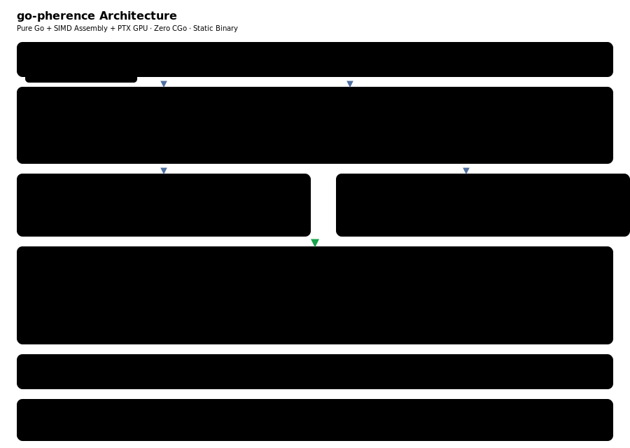

# go-pherence


A minimal tensor computation framework in pure Go with SIMD assembly and GPU compute,
inspired by [tinygrad](https://github.com/tinygrad/tinygrad).

## Architecture



## Runs LLMs in pure Go

```
$ llmgen -model Qwen2.5-7B-INT4 -tokens 30 -prompt "Why is the sky blue?"

Why is the sky blue? The sky appears blue because of a phenomenon called
Rayleigh scattering. When sunlight enters the Earth's atmosphere, it collides
with molecules and small particles in...
```

| Model | Params | Format | tok/s | ms/tok |
|---|---|---|---|---|
| SmolLM2-135M | 135M | BF16→F32 | **28.2** | 35 |
| SmolLM2-360M | 360M | BF16→F32 | **10.8** | 93 |
| SmolLM2-1.7B | 1.7B | BF16→F32 | **1.6** | 621 |
| Qwen2.5-7B | 7.6B | BF16→F32 | **0.9** | 1,075 |
| Qwen2.5-7B | 7.6B | GPTQ INT4 | **1.0** | 1,009 |
| GTE-small | 23M | — | — | 10.8ms/embed |

Single static binary. No Python, no C, no GGUF, no external dependencies.
AVX2+FMA on amd64, NEON on arm64. Zero per-inference allocations.

## GPU Compute (RTX 3060)

All GPU access via `purego` dlopen — zero CGo, static binary, GPU activates at runtime.

| Kernel | Performance | PTX |
|---|---|---|
| SGEMM (16×16 tiled) | **348 GFLOPS** @ 1024² | ✅ |
| INT4 fused dequant+GEMV | **197µs** @ 3584² (1.7e-6 diff) | ✅ |
| vec_add / mul / scale | threshold ≥2048 | ✅ |
| vec_silu | exp2 approx | ✅ |
| rms_norm | shared-memory reduction | ✅ |

Plus NV direct ioctl path (zero dependencies, raw `/dev/nvidia*` syscalls):
device discovery, GPU UUID, 84 SMs, channel group, host memory.

## Test Matrix


## Features

- **Lazy tensor DAG** with elementwise fusion (2× for chained ops)
- **Pattern matcher + graph rewrite** (tinygrad-style, 16 rules)
- **SIMD GEMM kernels** — AVX2 VGATHERDPS, NEON GEBP (from [gte-go](https://github.com/rcarmo/gte-go))
- **Safetensors loader** — F16/BF16/F32, sharded, GPTQ INT4
- **LLaMA decoder** — RoPE, GQA, KV cache, SiLU MLP, RMS norm
- **BERT encoder** — GTE-small at gte-go parity (10.8ms, 0 allocs)
- **BPE tokenizer** — GPT-2 byte-level + Qwen array format
- **NN modules** — Linear, LayerNorm, Embedding
- **GPU DevBuf** — device-agnostic buffers, lazy CPU↔GPU, every op has GPU kernel + CPU fallback
- **8 PTX kernels** — compiled by driver at runtime from embedded strings

## Quick Start

```bash
# Download a model
mkdir -p models/smollm2-135m
curl -L https://huggingface.co/HuggingFaceTB/SmolLM2-135M/resolve/main/model.safetensors \
  -o models/smollm2-135m/model.safetensors
curl -L https://huggingface.co/HuggingFaceTB/SmolLM2-135M/resolve/main/config.json \
  -o models/smollm2-135m/config.json
curl -L https://huggingface.co/HuggingFaceTB/SmolLM2-135M/resolve/main/tokenizer.json \
  -o models/smollm2-135m/tokenizer.json

# Run (CPU)
go run ./cmd/llmgen -model models/smollm2-135m -tokens 50 -prompt "Once upon a time"

# Run (GPU — auto-detects NVIDIA driver at runtime)
go run ./cmd/llmgen -gpu -model models/smollm2-135m -tokens 50 -prompt "Once upon a time"
```

## Regenerate Diagrams

```bash
bun run scripts/render-architecture.ts
bun run scripts/render-test-matrix.ts
```

## Documentation

- **[docs/architecture.md](docs/architecture.md)** — UOp graph, fusion, SIMD dispatch
- **[docs/development-log.md](docs/development-log.md)** — build process
- **[docs/performance.md](docs/performance.md)** — benchmarks, roadmap
- **[docs/gpu-options.md](docs/gpu-options.md)** — GPU compute paths

## License

MIT
